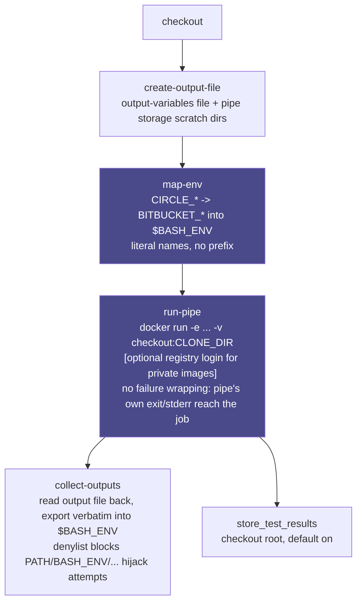

# Bitbucket Pipes Orb (Unofficial) [](https://circleci.com/gh/CircleCI-Labs/bitbucket-pipes-orb) [](https://circleci.com/developer/orbs/orb/cci-labs/bitbucket) [](https://raw.githubusercontent.com/CircleCI-Labs/bitbucket-pipes-orb/main/LICENSE) [](https://discuss.circleci.com/c/ecosystem/orbs)

Run a single [Bitbucket Pipe](https://bitbucket.org/product/features/pipelines/integrations) --
any Docker image built to the Bitbucket Pipelines pipe contract -- as one step inside an
otherwise-native CircleCI job or workflow. If your team already has a pipe it likes (an
Atlassian one, or your own), this orb gets you running it on CircleCI with no rewrite: the pipe's
own `variables:` reach it under their real Bitbucket names, CircleCI's build context is mapped
onto the `BITBUCKET_*` variables the pipe actually reads, and anything the pipe writes back comes
out into native CircleCI steps.

---
**Disclaimer:**

CircleCI Labs, including this repo, is a collection of solutions developed by members of
CircleCI's field engineering teams through our engagement with various customer needs.

-   ✅ Created by engineers @ CircleCI
-   ⚠️ **Not yet used by production CircleCI customers.** This orb is currently dev-published only. What *is* verified: a real, credential-free pipe (`bitbucketpipelines/git-secrets-scan`, a genuine gitleaks scan) runs green in this repo's own CI, including a real CircleCI-checkout incompatibility this orb's own test discovered and worked around (`GITLEAKS_COMMAND=dir` -- see `.circleci/test-deploy.yml`).
-   ❌ **not** officially supported by CircleCI support

---

## Scope: one pipe, not a pipeline

This orb runs **one pipe per call** -- it is not a Bitbucket Pipelines emulator, and it does not
attempt to run a whole `bitbucket-pipelines.yml`. Everything around that one pipe (checkout,
build steps, deploys, notifications, other pipes) is meant to be **native CircleCI**, written the
normal CircleCI way. If a Bitbucket pipeline chains five pipes together, that becomes five calls
to this orb interleaved with whatever native steps you want between them -- not one orb call.

## Quick start

```yaml
version: 2.1
orbs:
  bitbucket: cci-labs/bitbucket@x.y.z
workflows:
  main:
    jobs:
      - bitbucket/pipe:
          image: bitbucketpipelines/demo-pipe-bash:0.1.0
          variables: |
            NAME=Mona Octocat
```

That's it -- no Bitbucket account, no Bitbucket Pipelines runner, and no rewrite of the pipe
itself. See [`src/examples/`](src/examples/) for the command form (inline among native steps),
private images, array variables, and pre/post-step interleaving.

## How it works

- **`bitbucket/pipe`** (job) and the **`pipe`** command do the same four things, in order:
  1. `create-output-file` -- creates the file a pipe can append output variables to.
  2. `map-env` -- exports CircleCI's build context onto the `BITBUCKET_*` variables pipes read.
  3. `run-pipe` -- `docker run`s the image, with your workspace bind-mounted where pipes expect it,
     your `variables:` passed through under their literal Bitbucket names, and the pipe's own
     exit code and stderr reaching you unmodified. No retries, no wrapping, no assertion layer.
  4. `collect-outputs` -- reads back anything the pipe wrote and exports it into `$BASH_ENV`, so
     the very next native step can use it like any other CircleCI-set environment variable.
- These four are separate, composable commands specifically so you can call them yourself with
  native steps in between, and so a future version could chain more than one pipe per job without
  a breaking change. `pipe` is just the common case, pre-assembled. See
  [`docs/ROADMAP.md`](docs/ROADMAP.md)'s "Command-split decisions" for the full reasoning, and item
  1 for why that chaining isn't built yet.
- Runs on a `machine` executor. **Not** `docker` + `setup_remote_docker` -- see
  ["Limits"](#limits) for why.



**The two denylists worth remembering** (see "Bitbucket variables are literal" below for the full
reasoning): a `variables:`/`extra-env-mapping:`/pipe-output line naming a reserved shell-control
variable (`PATH`, `BASH_ENV`, ...) or one of the four paths this orb itself bind-mounts
(`BITBUCKET_CLONE_DIR` and friends) is warned-and-skipped, never applied -- both denylists exist
specifically because this orb's whole point is running third-party, potentially untrusted vendor
images with literal, unprefixed variable names.

**No vendor convenience-image executor here either, checked and deliberately skipped.** Every
Bitbucket Pipe is already its own purpose-built image -- `run-pipe` just `docker run`s it. See
[`docs/ROADMAP.md`](docs/ROADMAP.md)'s "Vendor-image layering" for the full reasoning, and "Test
results and artifacts" and "Limits" below for the two places a real difference *does* show up.

## Mapping your existing config

Here's a real Bitbucket Pipelines step running a pipe, next to this orb's equivalent:

```yaml
# bitbucket-pipelines.yml (Bitbucket Pipelines)
pipelines:
  default:
    - step:
        name: Deploy to S3
        script:
          - pipe: atlassian/aws-s3-deploy:1.7.0
            variables:
              AWS_ACCESS_KEY_ID: $AWS_ACCESS_KEY_ID
              AWS_SECRET_ACCESS_KEY: $AWS_SECRET_ACCESS_KEY
              AWS_DEFAULT_REGION: us-east-1
              S3_BUCKET: my-bucket
              LOCAL_PATH: dist
```

```yaml
# .circleci/config.yml (this orb)
version: 2.1
orbs:
  bitbucket: cci-labs/bitbucket@x.y.z
workflows:
  deploy:
    jobs:
      - bitbucket/pipe:
          image: bitbucketpipelines/aws-s3-deploy:1.7.0
          variables: |
            AWS_ACCESS_KEY_ID=$AWS_ACCESS_KEY_ID
            AWS_SECRET_ACCESS_KEY=$AWS_SECRET_ACCESS_KEY
            AWS_DEFAULT_REGION=us-east-1
            S3_BUCKET=my-bucket
            LOCAL_PATH=dist
```

What actually changed, concept by concept:

- **A Bitbucket "pipe" step becomes a `bitbucket/pipe` command (inline, among native steps) or
  job (standalone).** Bitbucket's `pipe:` attribute names a **repository reference**
  (`atlassian/aws-s3-deploy:1.7.0`) that Bitbucket's own backend resolves into a Docker image;
  this orb has no such resolver (a locked design decision -- see "Limits" below), so
  `image:` takes the pipe's real Docker image reference directly (typically the same
  organization's Docker Hub namespace, here `bitbucketpipelines/...` instead of
  `atlassian/...` -- check the pipe's own `pipe.yml` or Docker Hub page if unsure).
- **`variables:` goes from real Bitbucket YAML (a map) to this orb's flat `KEY=VALUE` lines** --
  same literal, unprefixed names either side (see "Bitbucket variables are literal" below), just
  a different YAML shape to hold them.
- **Where the vendor's env vars come from doesn't actually change much here**, which is unusual
  among this orb's sibling bridges: real Bitbucket Pipelines *also* expects secrets as plain
  repository/workspace variables referenced by name, so `$AWS_ACCESS_KEY_ID` means almost the
  same thing on both sides -- the only difference is which platform's UI you defined it in
  (Bitbucket's **Repository settings -> Variables**, versus a CircleCI **context** or **project
  environment variable**). This orb's `variables:`/`extra-env-mapping:` still run the value
  through `circleci env subst` at runtime, so the secret never has to be typed into committed
  config on either platform.
- **What Bitbucket's platform does for you that CircleCI does natively instead:** real Bitbucket
  auto-scans fixed test-report globs and calls that Pipelines' test-results feature -- this
  orb's `store-test-results` default (see "Test results and artifacts" below) is the direct
  equivalent, already wired up with zero extra config. Bitbucket has no fixed artifacts
  directory either, so there's nothing to port on that axis -- add your own `store_artifacts`
  step if you know the specific pipe's own output path.

## Bitbucket variables are literal -- no prefix

Unlike this orb's sibling ecosystem-bridge orbs, a pipe's `variables:` become environment
variables **under their exact, literal Bitbucket names** -- no prefix, no case change. If a
pipe's docs say it reads `AWS_ACCESS_KEY_ID`, you write `AWS_ACCESS_KEY_ID=...` in this orb's
`variables:` parameter, and that pipe's own container sees literally `AWS_ACCESS_KEY_ID`.

Array variables can be written either way, and both produce the identical container-side result:

- Bitbucket's own flat convention, typed out by hand -- `SOME_VAR_COUNT=2`, `SOME_VAR_0=...`,
  `SOME_VAR_1=...`.
- A bracket list, matching the exact syntax a Bitbucket *pipeline author* already writes on real
  Bitbucket (`SOME_VAR=['first', 'second']`) -- `run-pipe` flattens this into the `_COUNT`/`_0`/
  `_1`/... form itself, so you never have to hand-count array items or keep a `_COUNT` in sync
  with hand-typed `_N` entries. (Limitation: a comma inside a quoted item is treated as an item
  separator -- this is a plain split, not a full YAML/JSON parser.)

Use `$MY_SECRET` inside `variables:` (or `extra-env-mapping:`) to pull from a real CircleCI
context/project env var at runtime, via [`circleci env
subst`](https://circleci.com/changelog/new-cli-command-env-subst) -- the secret's value never
enters your CircleCI config.

### The literal-naming tradeoff: two small denylists

Because `variables:`/`extra-env-mapping:`/a pipe's own output-variables file all accept
Bitbucket's literal, unprefixed names, and this orb's whole point is running third-party (and
potentially untrusted) vendor images, "any identifier is a valid Bitbucket variable name" would
otherwise let a value collide with something that isn't a Bitbucket variable at all:

- **Reserved shell-control names** (`PATH`, `IFS`, `BASH_ENV`, `ENV`, `LD_PRELOAD`,
  `LD_LIBRARY_PATH`, and similar) are rejected -- warn-and-skip, same as a malformed line -- by
  `extra-env-mapping` and by the pipe's own output-variables file. Both of those sinks write into
  `$BASH_ENV`, which every later native step in the job sources; a pipe container (or a copy-paste
  mistake) naming one of these would otherwise rewrite the shell environment for the rest of the
  job. This does **not** apply to the plain `variables:` parameter -- those values only ever reach
  the pipe's own container via `docker run -e`, never `$BASH_ENV`, so they carry no such risk and
  keep the fully literal, unrestricted contract.
- **The four paths this orb itself bind-mounts** (`BITBUCKET_CLONE_DIR`,
  `BITBUCKET_PIPELINES_VARIABLES_PATH`, `BITBUCKET_PIPE_STORAGE_DIR`,
  `BITBUCKET_PIPE_SHARED_STORAGE_DIR`) are rejected the same way if a `variables:` line names one
  -- and, as a structural backstop, `run-pipe`'s own authoritative `-e` for each of these four is
  always emitted last, so Docker's real last-`-e`-wins behavior can't be used to desync a
  pipe's belief about these paths from the actual bind-mount target even if the denylist check
  above were somehow bypassed.

Neither denylist restricts any real Bitbucket usage: no official or third-party pipe declares an
input or output variable literally named `PATH`, `BASH_ENV`, or one of the four bind-mount paths
above -- those are either shell internals or platform-set constants a pipe *reads*, never a
`variables:` key a pipeline author sets.

**No output value is ever masked in logs.** Unlike CircleCI's own context/project secrets (which
CircleCI's log masking redacts by exact-match), a pipe's output-variables file, `variables:`
values, and anything `extra-env-mapping` sets are printed and passed through in plain text --
treat every value that reaches this orb, in either direction, as public log content.

## CircleCI -> Bitbucket variable mapping

`map-env` sets the identity/context rows below before the pipe runs; the last row
(`BITBUCKET_PIPELINES_VARIABLES_PATH` / `BITBUCKET_PIPE_STORAGE_DIR` /
`BITBUCKET_PIPE_SHARED_STORAGE_DIR`) is actually set by `create-output-file`, not `map-env` --
both run automatically as part of the `pipe` command/job, so this only matters if you're composing
the four commands yourself and skip one of them. "Confirmed" means the mapping (or the variable's
real usage) was verified against Atlassian's docs and/or real pipe source; "synthesized" means
there is no CircleCI equivalent and a placeholder is generated purely so the pipe does not crash
on a missing variable.

| Bitbucket variable | Source | Status |
|---|---|---|
| `BITBUCKET_WORKSPACE`, `BITBUCKET_REPO_OWNER` (deprecated alias, still widely read) | `CIRCLE_PROJECT_USERNAME` | Confirmed |
| `BITBUCKET_REPO_SLUG` | `CIRCLE_PROJECT_REPONAME` | Confirmed |
| `BITBUCKET_REPO_FULL_NAME` | `$CIRCLE_PROJECT_USERNAME/$CIRCLE_PROJECT_REPONAME` | Synthesized (simple join) |
| `BITBUCKET_COMMIT` | `CIRCLE_SHA1` | Confirmed |
| `BITBUCKET_BUILD_NUMBER` | `CIRCLE_BUILD_NUM` | Confirmed |
| `BITBUCKET_BRANCH` | `CIRCLE_BRANCH` | Confirmed; only set on branch builds |
| `BITBUCKET_TAG` | `CIRCLE_TAG` | Confirmed; only set on tag builds |
| `BITBUCKET_PR_ID` | Trailing number parsed out of `CIRCLE_PULL_REQUEST` | **Format mismatch, best effort** -- Bitbucket wants a bare number, CircleCI's var is a full PR URL; left unset if unparsable |
| `BITBUCKET_CLONE_DIR` | Set to the `clone-dir` parameter (default `/opt/atlassian/pipelines/agent/build`), the bind-mount target | Confirmed |
| `BITBUCKET_GIT_HTTP_ORIGIN` / `BITBUCKET_GIT_SSH_ORIGIN` | Derived from `CIRCLE_REPOSITORY_URL` | Best effort -- keeps the repo's *real* host, which is more useful to a pipe than Atlassian's literal `bitbucket.org` example format, but is a deviation from it |
| `BITBUCKET_PIPELINE_UUID`, `BITBUCKET_STEP_UUID`, `BITBUCKET_WORKSPACE_UUID`, `BITBUCKET_REPO_UUID`, `BITBUCKET_PROJECT_UUID`, `BITBUCKET_STEP_TRIGGERER_UUID` | Generated per run | **Synthesized placeholders** -- not real Bitbucket identifiers, exist only so a pipe checking presence/uniqueness doesn't crash |
| `BITBUCKET_REPO_OWNER_UUID` (deprecated alias of `BITBUCKET_WORKSPACE_UUID`, still documented) | Same generated value as `BITBUCKET_WORKSPACE_UUID` | **Synthesized placeholder** |
| `BITBUCKET_PROJECT_KEY` | Derived from `CIRCLE_PROJECT_REPONAME` | **Synthesized placeholder** |
| `BITBUCKET_PIPELINES_VARIABLES_PATH`, `BITBUCKET_PIPE_STORAGE_DIR`, `BITBUCKET_PIPE_SHARED_STORAGE_DIR` | Orb-managed scratch paths | Confirmed mechanism, orb-synthesized paths |

Add to or override any of this with the `extra-env-mapping` parameter (multi-line
`BITBUCKET_VAR=value`, also run through `circleci env subst`), applied after the table above.

## Test results and artifacts

**`store_test_results` runs automatically, by default.** After the pipe runs, `pipe` (command and
job) calls `store_test_results` against the checkout root (`.`), gated by the `store-test-results`
parameter (default `true`). Real Bitbucket Pipelines auto-scans five fixed glob patterns rooted at
its own clone directory for JUnit XML (`surefire-reports/`, `failsafe-reports/`, `test-results/`,
`test-reports/`, `TestResults/`, each up to 3 levels deep) -- the checkout root is a safe superset
of all five, since CircleCI's own recursive XML scan doesn't need the exact subfolder names. A pipe
that writes no JUnit XML anywhere makes this a silent no-op, not a failure. Disable it with
`store-test-results: false` if you'd rather call `store_test_results` yourself (e.g. with a
narrower path), or if you're calling the `pipe` command more than once in the same job and only
want it after the last call.

**There is no equivalent `store-artifacts` default, and that's deliberate.** Real Bitbucket has no
fixed artifact directory at all -- every pipe declares its own `artifacts:` paths, and those
artifacts are transient (14-day expiry, step-to-step handoff), not a persistent store this orb
could point at. The only directory this orb *does* own is the bind-mounted checkout root itself
(the same one `store-test-results` scans above), and defaulting `store_artifacts` there would
upload the entire repository on every run -- a materially worse default than no default at all. If
you know the specific pipe you're running deposits real output files at a predictable path inside
the checkout, add your own `store_artifacts` step (or `post-steps:` on the `pipe` job) pointed at
that path.

## Defaults that deviate from a bare `docker run`

| Parameter | Bitbucket Pipelines' own default | This orb's default | Why |
|---|---|---|---|

**No deviations found.** Every default this orb sets was checked against what a plain `docker run`
(this orb's own execution mechanism -- there's no separate Bitbucket Pipelines CLI to compare
against) or Bitbucket Pipelines' own documented default behavior would already do, and each one
matches rather than deviates: `user` is left empty (pipe containers run as root, matching
Bitbucket's own real-world behavior); `store-test-results` defaults to `true` because real
Bitbucket Pipelines *also* auto-scans fixed JUnit-XML glob patterns by default, so this orb's
default keeps the two platforms' out-of-the-box behavior aligned rather than introducing a
difference; `clone-dir` defaults to the same path (`/opt/atlassian/pipelines/agent/build`) real
Bitbucket Pipelines itself uses; and there is deliberately no `store-artifacts` default, matching
Bitbucket's own lack of a fixed artifact directory (see just above). Nothing here was invented to
fill out the table -- if a genuine deviation is added later, it belongs there.

**Matching Bitbucket Cloud's own default build-step tools, for a `pre-steps`/`post-steps` migrated
from plain `script:` commands (not a Pipe):** if your old Bitbucket pipeline ran ordinary shell
commands in Bitbucket Cloud's default container *around* a Pipe -- not the Pipe itself, which
already carries its own tools -- and you want that same tool footprint (`docker-compose`, `ant`, a
specific `node`/`python`) in a native CircleCI `pre-steps`/`post-steps` step, use Atlassian's own
`atlassian/default-image` there:

```yaml
- bitbucket/pipe:
    image: some/pipe
    pre-steps:
      - run:
          name: A plain shell command that used to run in Bitbucket Cloud's own default container
          # NEVER pin ":latest" here -- Atlassian's own Docker Hub page documents that
          # ":latest" resolves to v1 (Ubuntu 14.04, 2014-era) for backward compatibility, not
          # the current image. Pin an explicit major version instead.
          command: docker run --rm -v "$(pwd):/work" -w /work atlassian/default-image:5 docker-compose version
```

This is a documentation/parity aid, not something this orb wires up itself: `atlassian/default-image`
is Bitbucket Cloud's *outer* build-step container, and this orb's `run-pipe` never executes your
code in that layer -- the Pipe's own image already carries whatever it needs. Checked directly
against Docker Hub while researching this orb's vendor-image options: unlike the sibling `bitrise`
orb (whose Steps genuinely run bare with nothing else providing a toolchain), there's no gap here
for a default executor to fill.

## Immutable pinning

`image` is passed through verbatim -- no version resolution of any kind. Any reference other
than a full digest pin can silently point at different image content later with no diff in
this repo to review: an omitted tag means `:latest` (the most mutable case), but even an
explicit version tag (`bitbucketpipelines/aws-ecs-deploy:1.15.0`) can be force-moved by the
image's own maintainer. `run-pipe` prints a one-line `WARNING` to the step's stderr whenever
`image` doesn't contain `@sha256:...`, mirroring the identical unpinned-`#ref` warning the
sibling `buildkite` orb already prints for a plugin reference with no ref pinned. To pin by
digest, pull the image once and read its digest back:

```shell
docker pull bitbucketpipelines/aws-ecs-deploy:1.15.0
docker inspect --format '{{.RepoDigests}}' bitbucketpipelines/aws-ecs-deploy:1.15.0
# => [bitbucketpipelines/aws-ecs-deploy@sha256:1a2b3c...]
```

then use that full `image@sha256:...` string as `image`. This is a warning, not an enforced
gate -- pinning is recommended, not required.

## Caching the pipe image

The `default` executor's `docker_layer_caching` parameter (off by default) enables CircleCI's
Docker Layer Caching for the `machine` executor's Docker daemon. **This is an opt-in, billed
feature, gated by your CircleCI plan** -- see
[CircleCI's Docker Layer Caching docs](https://circleci.com/docs/docker-layer-caching/) for
current plan eligibility and pricing. See [`docs/ROADMAP.md`](docs/ROADMAP.md)'s "Image caching
economics" for the rule of thumb on when it's actually worth turning on.

## Passing pipe output across jobs

The output-variables mechanism described above (and `$BASH_ENV` generally) is job-scoped: a
pipe's output can reach a later native step in the *same* CircleCI job, but not a later job in
the same workflow. Two real, native CircleCI mechanisms cover this without any orb change:

- **Passing a value to a downstream job**: after `bitbucket/pipe` runs, write the value you need
  to a file and `persist_to_workspace` it, then `attach_workspace` in the downstream job and read
  the file with a plain `run` step.
- **Branching which jobs run based on an upstream job's output** (a genuine workflow-level
  conditional): CircleCI has no native construct for this. The closest real mechanism is a setup
  workflow plus the
  [`circleci/continuation`](https://circleci.com/developer/orbs/orb/circleci/continuation) orb,
  where an early job computes a value and calls `continuation/continue` with a config whose
  `workflows:` block is shaped by that value. See [`docs/ROADMAP.md`](docs/ROADMAP.md)'s
  "Workspace / parallelism fit" for why this wasn't built as an orb feature.

## Limits

- **Bitbucket-hosted pipe references (`account/repo:tag`)**: this orb only runs `docker://`-style
  image references, passed to `docker run` verbatim, per this project's locked design decision to
  do zero image-resolution of its own. Point `image:` at the pipe's real Docker image (check its
  `pipe.yml` `image:` field, or run `docker run --rm --entrypoint cat <image> /pipe.yml` against
  any candidate image to read its baked-in metadata). See [`docs/ROADMAP.md`](docs/ROADMAP.md)
  item 4.
- **`BITBUCKET_STEP_OIDC_TOKEN`**: no CircleCI equivalent exists, and none is synthesized (unlike
  the identity UUIDs above, a fake token would be actively misleading, not just a placeholder). A
  pipe that authenticates to AWS/GCP via Bitbucket's OIDC federation cannot do so through this
  bridge -- give it long-lived credentials via `variables:`/CircleCI contexts instead, if the pipe
  supports that. See [`docs/ROADMAP.md`](docs/ROADMAP.md) item 3.
- **`BITBUCKET_DEPLOYMENT_ENVIRONMENT` / `BITBUCKET_DEPLOYMENT_ENVIRONMENT_UUID`**: no CircleCI
  concept maps onto Bitbucket's deployment environments, so these are left unset rather than
  guessed. Set them yourself via `extra-env-mapping` if a pipe needs a specific value. See
  [`docs/ROADMAP.md`](docs/ROADMAP.md) item 3.
- **A `docker` executor**: CircleCI's `docker` executor with `setup_remote_docker` runs its Docker
  daemon in a separate remote VM with no filesystem shared with the job -- bind mounts silently
  don't work there, and CircleCI's own docs point you at `docker cp` instead. Only `machine` is
  supported; use it. See [`docs/ROADMAP.md`](docs/ROADMAP.md) item 2 for the full reasoning.
- **Root-owned files from the pipe container**: pipe containers run as root by default (matching
  Bitbucket's own real-world behavior). On a real Linux `machine` executor this can leave
  root-owned files in your checkout that break later native steps -- set `fix-permissions: true`
  if you hit this. (This specific failure mode does not reproduce under Docker Desktop on macOS,
  whose bind-mount layer transparently remaps container UIDs; it was verified against well-known
  Docker semantics for genuine Linux, not hands-on-reproduced in this project's own testing.)
- **Bitbucket's own output-variables mechanism catches less than you'd expect**: real pipes
  almost never write to `$BITBUCKET_PIPELINES_VARIABLES_PATH` -- across a sample of Atlassian's
  own official pipes, none did. Pipes that do hand data forward mostly write their own file into
  the workspace (documented in that pipe's own README) instead. The good news: since that file is
  inside the bind-mounted workspace already, a later native step can just read it directly with
  zero extra plumbing -- you don't need this orb's output-variable mechanism for that at all. Real
  Bitbucket also caps this mechanism at 50 shared variables / 100KB combined (key+value) per
  pipeline; this orb enforces no equivalent limit of its own -- `collect-outputs` exports every
  line in the file unconditionally (minus the reserved-name denylist above).
- **One pipe per orb call**: by design (see "Scope" above). The underlying commands are layered
  so chaining could be added later without a breaking change, but that isn't built yet -- see
  [`docs/ROADMAP.md`](docs/ROADMAP.md) item 1.
- **Pipes that call the Bitbucket Cloud REST API against the *running pipeline itself*, not just
  a generic cloud provider**: this orb runs a pipe's Docker image, but it never talks to
  Bitbucket's own control plane, so a pipe that expects to reach back into Bitbucket's own
  pipeline/runner APIs has no equivalent here. Two concrete, named examples (checked directly
  against the real `bitbucketpipelines` Docker Hub catalog while researching this orb):
  `bitbucket-clear-cache`/`clear-cache` (calls the Pipelines Caches API, scoped to a real running
  Bitbucket pipeline's cache -- there is no equivalent to point it at here, the same shape as the
  sibling `bitrise` orb's Save/Restore Cache Steps limitation) and `runners-autoscaler` (manages
  Bitbucket's own self-hosted-runner fleet via the Cloud API -- categorically not something
  running inside a CircleCI step can substitute for). `BITBUCKET_STEP_OIDC_TOKEN` above is the
  same underlying gap in miniature.

## Commands and job reference

| Name | Kind | What it does |
|---|---|---|
| `pipe` | command, job | The aggregate most users want: create-output-file -> map-env -> run-pipe -> collect-outputs -> store_test_results, in order. |
| `create-output-file` | command | Creates the output-variables file + the two pipe-storage scratch dirs. **Truncates the variables file on every call** -- so when chaining, give each pipe its own `output-file` rather than reusing one path (see below). |
| `map-env` | command | Exports the CIRCLE_*->BITBUCKET_* mapping into `$BASH_ENV`. |
| `run-pipe` | command | The `docker run` invocation itself. Named `run-pipe`, not `run`, to avoid colliding with CircleCI's own built-in `run` step. |
| `collect-outputs` | command | Reads the output file back and exports it into `$BASH_ENV`. |

**Reach for the granular commands instead of the `pipe` aggregate when:** you're chaining more
than one pipe in one job (see [`src/examples/chain_two_pipes.yml`](src/examples/chain_two_pipes.yml)
-- `skip-map-env` on later calls avoids redundant work), or you need native steps interleaved
between individual stages (e.g. inspecting the mapped `BITBUCKET_*` vars before `run-pipe`).

### `pipe` (command and job) parameters

| Parameter | Type | Default | What it does |
|---|---|---|---|
| `executor` *(job only)* | executor | `default` | Must be a `machine` executor -- see "Limits." |
| `checkout` | boolean | `true` | Check out the project first. |
| `image` | string | *(required)* | The pipe's Docker image reference, passed to `docker run` verbatim. |
| `variables` | string | `""` | The pipe's `variables:` as multi-line `KEY=VALUE`, literal Bitbucket names. `$SECRET` resolved via `circleci env subst`. |
| `skip-map-env` | boolean | `false` | Skip the CIRCLE_*->BITBUCKET_* mapping. Most pipes need at least `BITBUCKET_REPO_OWNER`; only skip if you supply everything yourself. |
| `extra-env-mapping` | string | `""` | Multi-line `BITBUCKET_VAR=value` pairs added on top of (and overriding) the built-in mapping. |
| `clone-dir` | string | `/opt/atlassian/pipelines/agent/build` | Container-side path the checkout is bind-mounted at (`$BITBUCKET_CLONE_DIR`). |
| `output-file` | string | `/tmp/bitbucket-pipe-scratch/pipe-output.env` | Host-side path for the pipe's output-variables file. |
| `pipe-storage-dir` | string | `/tmp/bitbucket-pipe-scratch/storage` | Host-side scratch dir mapped to `BITBUCKET_PIPE_STORAGE_DIR`. |
| `pipe-shared-storage-dir` | string | `/tmp/bitbucket-pipe-scratch/shared-storage` | Host-side scratch dir mapped to `BITBUCKET_PIPE_SHARED_STORAGE_DIR`. |
| `user` | string | `""` | Optional `--user` for `docker run` (e.g. `1000:1000`). Empty means the pipe's container runs as root, matching real Bitbucket. |
| `fix-permissions` | boolean | `false` | `chown` the checkout back to the CircleCI user after the pipe exits. |
| `extra-docker-args` | string | `""` | Extra flags appended to `docker run`, before the image reference. Understand the cost before reaching for one: `--network host` removes the pipe container's network isolation, putting it on the job's own network namespace where it can reach anything bound in the job (including cloud-instance metadata endpoints). It is only necessary when the pipe must reach a server running inside the job container, which a sibling container on the default bridge genuinely cannot do -- not as a general fix for connectivity problems. |
| `registry-username` | env_var_name | `BITBUCKET_PIPE_REGISTRY_USERNAME` | Name of the env var holding a private image's registry username. |
| `registry-password` | env_var_name | `BITBUCKET_PIPE_REGISTRY_PASSWORD` | Name of the env var holding a private image's registry password/token. |
| `registry-server` | string | `""` | Registry host to log in to. Empty means Docker Hub. |
| `step-name` | string | `Run Bitbucket pipe` | Name of the `docker run` step -- override when chaining pipes so job-log steps are distinguishable. |
| `store-test-results` | boolean | `true` | Auto-run `store_test_results` against the checkout root after the pipe. |

Individual commands (`create-output-file`, `map-env`, `run-pipe`, `collect-outputs`) expose the
matching subset of these parameters under the same names -- see each command's own description on
the [Orb Registry page](https://circleci.com/developer/orbs/orb/cci-labs/bitbucket) for the
exhaustive, always-current list.

### Worked example: composing the granular commands by hand

```yaml
version: 2.1
orbs:
  bitbucket: cci-labs/bitbucket@x.y.z
jobs:
  deploy:
    machine:
      image: ubuntu-2404:current
    steps:
      - checkout
      - bitbucket/create-output-file
      - bitbucket/map-env
      - bitbucket/run-pipe:
          image: bitbucketpipelines/aws-s3-deploy:1.7.0
          variables: |
            AWS_ACCESS_KEY_ID=$AWS_ACCESS_KEY_ID
            AWS_SECRET_ACCESS_KEY=$AWS_SECRET_ACCESS_KEY
            AWS_DEFAULT_REGION=us-east-1
            S3_BUCKET=my-bucket
            LOCAL_PATH=dist
      - bitbucket/collect-outputs
      - store_test_results:
          path: .
workflows:
  main:
    jobs:
      - deploy
```

The `pipe` **job** (only when invoked from a workflow's `jobs:` list, not the `pipe` command
inside another job's own `steps:`) also accepts CircleCI's own built-in `pre-steps`/`post-steps`
arguments -- available on every 2.1+ job, not something this orb declares. Pass them at the call
site, e.g.:

```yaml
- bitbucket/pipe:
    image: bitbucketpipelines/demo-pipe-bash:0.1.0
    pre-steps:
      - run: echo "before checkout AND before the pipe"
    post-steps:
      - run: echo "after the pipe; its outputs are already in $BASH_ENV"
```

One real platform caveat worth calling out: `pre-steps` run before **every** step in the job,
including this job's own internal `checkout` -- not just before the pipe. If a pre-step needs the
repo checked out, do that checkout yourself inside the pre-step, or use the `pipe` command with
native steps around it instead (see [`src/examples/`](src/examples/)).

## Native primary container: running the pipe's own image as the job container

Everything above runs the pipe with `docker run` from a separate `machine`-executor container.
There is a second, narrower path: give the pipe's own image straight to a `docker` executor as
the job's **primary container**. CircleCI ignores a primary container's own `ENTRYPOINT`/`CMD`
and runs the job's `steps:` inside the already-live container -- so `bitbucket/pipe-native` just
execs the pipe's real entrypoint as an ordinary `run:` step. No `docker run`, no bind mount, no
`--user`/root-forcing, no fix-permissions chown afterward.

```yaml
version: 2.1
orbs:
  bitbucket: cci-labs/bitbucket@x.y.z
workflows:
  main:
    jobs:
      - build_workspace # an earlier, ordinary job that checks out and persist_to_workspace's
      - bitbucket/pipe-native:
          requires: [build_workspace]
          image: bitbucketpipelines/git-secrets-scan:3.2.0
          entrypoint: python3 /pipe.py
          workspace-root: /tmp/workspace
          variables: |
            CREATE_REPORT=false
            GITLEAKS_COMMAND=dir
            GITLEAKS_EXTRA_ARGS=/tmp/workspace
```

See [`src/examples/native_pipe_usage.yml`](src/examples/native_pipe_usage.yml) for a complete,
runnable version, and `.circleci/test-deploy.yml`'s `"Test native primary container..."` job for
this repo's own real CI proof against that exact image.

### Why this needs `entrypoint` as a required parameter, with no default

A pipe's real entrypoint is vendor-chosen and arbitrary -- `/pipe.sh`, `python3 /pipe.py`,
`/usr/bin/pipe` -- and there is no way to discover it from inside the container: `docker inspect`
needs a Docker daemon, and a `docker`-executor primary container has none. So `entrypoint` has no
default; omitting it is a `circleci config validate` error, not a runtime guess. Find the right
value in the pipe's own Dockerfile/documentation, or with
`docker run --rm --entrypoint cat <image> /pipe.yml` against any candidate image.

### Why the primary container's own `entrypoint:`/`command:` keys are NOT used here

CircleCI jobs also have a job-level `entrypoint:`/`command:` (and a `com.circleci.preserve-entrypoint`
image label) for keeping a primary container's own baked-in entrypoint alive instead of overriding
it. This orb deliberately does **not** use that mechanism: a preserved entrypoint starts **before**
this job's own `steps:` -- before `checkout`/`attach_workspace`, before anything -- and CircleCI's
own docs describe an entrypoint as expected to run **forever**, the way a database or proxy
sidecar would. A pipe is the opposite of that: it runs once, produces output, and exits. If a
pipe's process exits under a preserved entrypoint, the **job terminates** and no later step ever
runs -- which would silently discard every step after it, the exact "silently do nothing" failure
mode this family of orbs is built to avoid. Exec'ing the entrypoint as an ordinary `run:` step
(what `run-pipe-native.sh` actually does) sidesteps this entirely: it runs in its own step, at the
point in `steps:` you asked for, and its exit code is that step's exit code like any other.

### The mandatory preflight, and its exact refusal messages

`pipe-native` (and the `pipe-native` job) run `preflight-native` **first**, before
`checkout`/`attach_workspace`, so an ineligible image fails fast with a specific, actionable
reason instead of a confusing break partway through (a `checkout` that dies mid-clone because git
is missing, or a pipe binary that dies on its first HTTPS call because the CA bundle is empty).
Every check is a check of the container's own filesystem/`PATH` -- nothing here talks to a Docker
daemon, because a `docker`-executor primary container doesn't have one.

Checked in this order, refusing at the first failure:

1. **Docker-daemon requirement** (e.g. `plugins/docker`). Detected by looking for a
   `dockerd`/`dockerd-entrypoint.sh` binary directly on the container's filesystem -- a static
   signature, not a live probe, since there is no daemon to probe. **Honest limitation:** this
   only catches an image that *ships its own* `dockerd`. A pipe that merely shells out to a bare
   `docker` CLI and assumes some *externally* reachable daemon via a pre-set `$DOCKER_HOST` leaves
   no such static signature on disk and is **not** reliably detectable from inside the container
   alone -- needing a live daemon at runtime is a behavior, not a file. That case is not caught; it
   is documented here instead of silently mis-claimed as covered.
   > `PREFLIGHT REFUSED (docker-daemon-required): found <path> in this image. This image ships its own dockerd (or a dockerd-entrypoint.sh wrapper) and expects a reachable Docker daemon via $DOCKER_HOST -- there is no daemon inside a CircleCI docker-executor primary container, and there never can be without --privileged (which the docker executor refuses). Use the existing machine-executor 'bitbucket/pipe' job (docker run against a real daemon) for this image instead of 'bitbucket/pipe-native'.`
2. **`tar` missing** -- `attach_workspace`/`checkout` need it to unpack the workspace archive.
   > `PREFLIGHT REFUSED (missing-tool: tar): 'tar' was not found in this image. attach_workspace (and checkout, if enabled) needs tar in the primary container to unpack the workspace/checkout archive -- see https://circleci.com/docs/custom-images/#adding-required-tools-to-a-custom-image`
3. **`gzip` missing** -- same rationale, `gzip` instead of `tar`.
4. **No usable CA bundle.** Checks four common bundle paths and requires one to exist **and**
   exceed 1024 bytes -- a bundle *present but empty/stub* is a real, verified case
   (`bitbucketpipelines/demo-pipe-bash:0.1.0`), so existence alone isn't enough.
   > `PREFLIGHT REFUSED (missing-ca-certificates): no usable CA certificate bundle was found in this image (checked /etc/ssl/certs/ca-certificates.crt, /etc/ssl/certs/ca-bundle.crt, /etc/pki/tls/certs/ca-bundle.crt, /etc/ssl/cert.pem -- each must exist AND be larger than 1024 bytes, since a present-but-empty/stub bundle file is a real case this orb has seen). Without real CA certificates, HTTPS calls this job needs (CircleCI's own API for attach_workspace/persist_to_workspace, and most pipe backends) will fail with certificate-verification errors.`
5. **`git`/`ssh` missing** -- only checked when `checkout: true` is requested (the default,
   `checkout: false`, needs neither).
   > `PREFLIGHT REFUSED (missing-tool: git): 'git' was not found in this image, but checkout: true was requested. See https://circleci.com/docs/custom-images/#adding-required-tools-to-a-custom-image -- either set checkout: false and rely on attach_workspace instead (this job's default), or use an image that includes git.`

BusyBox `tar`/`gzip` (common on Alpine) is a **warning**, not a refusal -- CircleCI's own guidance
recommends GNU tar/gzip because BusyBox's variants have known incompatibilities that can silently
corrupt `attach_workspace`/`persist_to_workspace` archives; the job still proceeds.

Verified directly (`docker run --entrypoint sh <image>` against each real image, not taken on
faith) against the five images sampled while designing this path -- and the results have
**drifted** from that design pass for the two Bitbucket-flavored ones, confirmed while wiring up
this repo's own CI:

| Image | Preflight verdict (checkout: false) | Why |
|---|---|---|
| `bitbucketpipelines/git-secrets-scan:3.2.0` | **Passes** | Has everything the custom-image guide requires; entrypoint `python3 /pipe.py`. The only one of the five this repo's own CI runs the full working path against. |
| `plugins/docker` | Refused: `docker-daemon-required` | Ships `dockerd`/`dockerd-entrypoint.sh`, needs `$DOCKER_HOST`. Matches the design pass. |
| `plugins/s3` | Refused: `missing-tool: tar` (also has no `git`/`gzip`) | Fails the very first tool check. Matches the design pass. |
| `bitbucketpipelines/demo-pipe-bash:0.1.0` | **Passes** with `checkout: false`; refused (`missing-tool: git`) only with `checkout: true` | **Drifted from the design pass's "zero CA certificates" call** -- as of this writing it ships a real ~230KB `/etc/ssl/cert.pem`. It does still lack `git`, so this repo's own CI uses it (a real image, not a fixture) for the `checkout: true` missing-`git` branch instead. |
| `plugins/slack` | **Passes** with `checkout: false` | **Also drifted** (its "CA bundle is a stub" call no longer holds either). Covered by the sibling `harness-orb`'s own test suite (using its own `checkout: true` git-missing branch), not this repo's. |

That drift is exactly the risk "Immutable pinning" above warns about: neither Bitbucket-flavored
sampled image was pinned by digest, so both floated to different real content between the design
pass and this writing. **Net effect: neither of this repo's two Bitbucket-flavored sampled images
currently demonstrates the `missing-ca-certificates` refusal.** That branch is still real code
with a still-real test, just not one backed by a still-eligible sampled image; this repo's own CI
covers it with a small synthetic fixture (Alpine with both known CA bundle file paths truncated
to empty) built on the fly instead, documented as a real, current gap rather than silently passed
off as sampled-image coverage.

### `attach_workspace` by default, `checkout` as opt-in

`pipe-native`/the `pipe-native` job default `checkout: false` and run `attach_workspace` instead.
Attaching a workspace an earlier, ordinary job (any ordinary `cimg/base`-class executor) already
ran `checkout` in sidesteps the git/ssh/ca-certificates requirement on the **pipe's own image**
entirely -- the pipe's image only ever needs to be tooling-complete enough for `attach_workspace`
(tar/gzip/ca-certificates), a meaningfully lower bar than full `checkout` (+ git/ssh). Set
`checkout: true` only for an image you know can support it -- `preflight-native` enforces the
stricter tier when you do.

### Does `map-env` drop in unmodified here? Checked, not assumed -- and the answer is DIFFERENT from `run-pipe`.

This was checked script-by-script, not assumed, and the two commands that make up the docker-run
path's env handling landed on **opposite** answers:

- **`map-env` drops in completely unmodified.** It already writes the CIRCLE_*->BITBUCKET_*
  mapping straight into `$BASH_ENV` (it always did -- that's how its values reach `run-pipe`'s
  `docker run -e VARNAME` passthrough in the *existing* docker-run path too), and every later
  `run:` step (including `run-pipe-native`) sources `$BASH_ENV` automatically at start. The only
  thing that changes calling it in native mode is the *value* passed to its `clone-dir` parameter
  -- the real, unmounted workspace-root path instead of the docker-run path's bind-mount target --
  not the command's code.
- **`run-pipe`'s `variables:` handling does NOT drop in unmodified.** In the docker-run path, that
  logic lives inside `run-pipe.sh` and turns each `variables:` line into a `docker run -e
  KEY=value` flag (with bracket-list arrays flattened into `_COUNT`/`_0`/`_1`/...). There is no
  `docker run` in this model, so shipping this path while reusing `run-pipe.sh` unmodified would
  have meant `variables:` silently never reaching the pipe at all -- the specific "silently
  half-works" failure mode this family of orbs exists to avoid. **`run-pipe-native.sh`** is a new
  script carrying the identical parsing/flattening/reserved-name-denylist logic, but exporting
  each variable directly into its own step's process (not `$BASH_ENV`) immediately before
  exec'ing the entrypoint -- which also preserves the real Bitbucket-variables scoping documented
  in "Bitbucket variables are literal" above: a `variables:` value reaches only the pipe, never a
  later native step, exactly as in the docker-run path.

**`create-output-file` and `collect-outputs` also drop in completely unmodified.** Neither has any
docker/bind-mount assumption baked in to begin with: `create-output-file` just creates an empty
file (and two scratch directories) at given paths, and `collect-outputs` just reads a file back
and exports its contents into `$BASH_ENV`. Whether the pipe wrote to that path via a bind mount or
because it's running directly inside the same container is invisible to both scripts.

### What you give up, and what you don't get for free

- **No `--user`/root-forcing control.** The pipe runs as whatever user its own image's Dockerfile
  sets, for the entire job -- there is no per-invocation `--user` override the way `run-pipe` has,
  because there is no `docker run` invocation here to attach one to.
- **No chaining two *different* pipe images in one job.** The primary container is fixed for the
  whole job's lifetime -- that's the platform mechanism [`chain_two_pipes.yml`](src/examples/chain_two_pipes.yml)
  relies on `machine` + repeated `docker run` to get around, and this path structurally cannot.
- **Not cheaper than `setup_remote_docker`.** Since June 2023, CircleCI bills remote Docker at the
  same rate as `machine` -- the real saving here is against a `machine`-executor VM's 30-60s boot
  time and its per-second-of-VM billing, at the plain `docker`-executor rate, not against
  `setup_remote_docker` specifically. This only pays off for a pipe that genuinely needs no Docker
  daemon of its own at all.
- **What it does buy:** no `machine` VM boot, the plain `docker`-executor billing rate, and no
  post-run `fix-permissions` chown -- because nothing ever wrote into a bind-mounted,
  differently-UID'd container in the first place.

### The pipe's *dependency* is a service container; the pipe itself is not (docs only, no new code)

If a pipe needs to **talk to** something -- a Redis or Postgres it connects to, not the pipe
itself -- that dependency is a legitimate CircleCI [service
container](https://circleci.com/docs/glossary/#service-container), or a plain `docker run -d` in
a step, reached over `--network host` through this orb's existing `extra-docker-args` (see the
"Immutable pinning"/`extra-docker-args` description above for what `--network host` costs). This
is explicitly the right pattern for a pipe's dependency, and explicitly the **wrong** one for the
pipe itself: a service container gives you no way to read its exit code, no way to sequence it as
a step among other steps, and no way to feed it variables computed earlier in the job -- all three
of which `pipe`/`pipe-native` give you for the pipe itself. Nothing in this orb builds or wires up
a service container automatically; this section is documentation of an existing, already-general
CircleCI mechanism, not a new command.

### Commands and job reference (native path)

| Name | Kind | What it does |
|---|---|---|
| `pipe-native` | command, job | The aggregate: preflight-native -> checkout/attach_workspace -> create-output-file -> map-env (reused unmodified) -> run-pipe-native -> collect-outputs -> store_test_results. |
| `preflight-native` | command | Refuses an ineligible image with a specific reason (see above). Runs first, always. |
| `run-pipe-native` | command | Execs `entrypoint` as an ordinary `run:` step, with `variables:` exported directly into that step's own process. |
| `native` | executor | `docker` executor whose primary container is the pipe's own `image`. |

`pipe-native`'s `entrypoint` parameter has no default (see above) -- every other parameter mirrors
`pipe`'s equivalent under the same name, with `checkout` defaulting to `false` here (mirrored, not
the same value) instead of `true`, and `clone-dir` renamed to `workspace-root` to make clear it's
now a real, unmounted path rather than a bind-mount target.

This is a **separate** job/command from `pipe`/`bitbucket/pipe`, deliberately -- never a parameter
flip on the existing one, so nobody lands in this narrower contract (no `--user`, one image per
job, `preflight-native` gating) by accident.

## Legal / compliance

This orb implements pipe execution purely as a `docker run` against the pipe's own published
image, using only its publicly documented `variables:`/output-variables contract -- it does not
read, copy, or fork any Bitbucket Pipelines runner source, and it never contacts Bitbucket's own
control plane (no account, no runner registration). The pipe image itself is whatever the
pipe's own publisher (Atlassian or a third party) ships under that image's own license -- check
its Docker Hub/`pipe.yml` before relying on it in a context where that matters, the same
diligence you'd apply running any third-party container image.

## Resources

[CircleCI Orb Registry Page](https://circleci.com/developer/orbs/orb/cci-labs/bitbucket) - the
official registry page of this orb for all versions, executors, commands, and jobs described.

[CircleCI Orb Docs](https://circleci.com/docs/orb-intro/#section=configuration) - docs for using,
creating, and publishing CircleCI orbs.

[Bitbucket Pipes reference](https://support.atlassian.com/bitbucket-cloud/docs/) - Atlassian's
own pipe docs, including the "Default variables" and step `output-variables` reference pages this
orb's env mapping and output handling are built from.

## How to Contribute

We welcome [issues](https://github.com/CircleCI-Labs/bitbucket-pipes-orb/issues) and [pull
requests](https://github.com/CircleCI-Labs/bitbucket-pipes-orb/pulls) against this repository! See
[`docs/ROADMAP.md`](docs/ROADMAP.md) for items deliberately scoped out of past passes, with the
reasoning recorded rather than lost.

**CircleCI CLI version floor: `>= 1.0.48254`.** Older CLI builds silently pack this orb's
`<<include(...)>>` directives as literal text instead of expanding them, producing a broken orb
that can still pass `circleci orb validate` -- a false green with no other symptom. Run
`scripts/check-circleci-cli-version.sh` (also wired into `.circleci/config.yml`'s `lint-pack`
workflow) before packing locally if you're not sure which build you have.

**`pre-steps`/`post-steps` are reserved job-parameter names.** `circleci orb validate` rejects a
job parameter literally named `pre-steps` or `post-steps` outright -- this only surfaces under
`orb validate`, which needs a token, so a plain `circleci config validate`/pack will not catch it.
If you're adding a new job parameter, don't pick either name.

## How to Publish An Update

1. Merge pull requests with desired changes to the main branch.
   - For the best experience, squash-and-merge and use [Conventional Commit
     Messages](https://conventionalcommits.org/).
2. Find the current version of the orb.
   - You can run `circleci orb info cci-labs/bitbucket | grep "Latest"` to see the current
     version.
3. Create a [new Release](https://github.com/CircleCI-Labs/bitbucket-pipes-orb/releases/new) on
   GitHub.
   - Click "Choose a tag" and _create_ a new [semantically versioned](http://semver.org/) tag.
     (ex: v1.0.0)
4. Click _"+ Auto-generate release notes"_.
5. Ensure the version tag selected is semantically accurate based on the changes included.
6. Click _"Publish Release"_ -- this pushes the tag and triggers the publishing pipeline.
