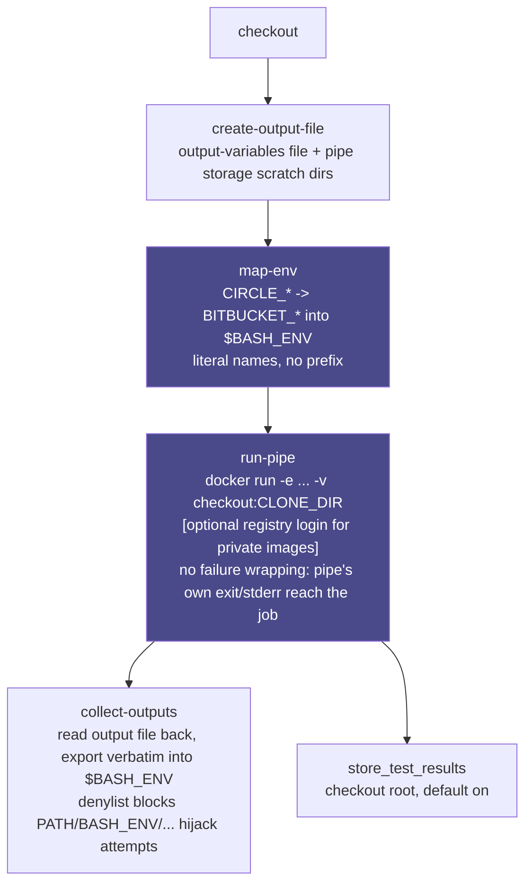

# Architecture

How `bitbucket-pipes-orb` executes a pipe, the command pipeline behind `bitbucket/pipe`, and the
second, narrower execution model behind `bitbucket/pipe-native`.

## Table of contents

- [Scope: one pipe, not a pipeline](#scope-one-pipe-not-a-pipeline)
- [The docker-run path](#the-docker-run-path)
  - [The four steps](#the-four-steps)
- [The native primary-container path](#the-native-primary-container-path)
  - [Why `entrypoint` is required, with no default](#why-entrypoint-is-required-with-no-default)
  - [Why the primary container's own `entrypoint:`/`command:` keys are not used](#why-the-primary-containers-own-entrypointcommand-keys-are-not-used)
  - [The mandatory preflight](#the-mandatory-preflight)
  - [`attach_workspace` by default, `checkout` as opt-in](#attach_workspace-by-default-checkout-as-opt-in)
  - [Does `map-env` drop in unmodified? Checked, not assumed](#does-map-env-drop-in-unmodified-checked-not-assumed)
  - [A pipe's dependency is a service container; the pipe itself is not](#a-pipes-dependency-is-a-service-container-the-pipe-itself-is-not)

## Scope: one pipe, not a pipeline

This orb runs **one pipe per call**. It is not a Bitbucket Pipelines emulator, and it does not
attempt to run a whole `bitbucket-pipelines.yml`. Everything around that one pipe (checkout, build
steps, deploys, notifications, other pipes) is meant to be native CircleCI, written the normal
CircleCI way. If a Bitbucket pipeline chains five pipes together, that becomes five calls to this
orb interleaved with whatever native steps you want between them, not one orb call.

## The docker-run path

### The four steps

`bitbucket/pipe` (job) and the `pipe` command do the same four things, in order:

1. **`create-output-file`**: creates the file a pipe can append output variables to, plus the two
   pipe-storage scratch dirs.
2. **`map-env`**: exports CircleCI's build context onto the `BITBUCKET_*` variables pipes read.
3. **`run-pipe`**: `docker run`s the image, with your workspace bind-mounted where pipes expect
   it, your `variables:` passed through under their literal Bitbucket names, and the pipe's own
   exit code and stderr reaching you unmodified. There are no retries, no wrapping, and no
   assertion layer.
4. **`collect-outputs`**: reads back anything the pipe wrote and exports it into `$BASH_ENV`, so
   the very next native step can use it like any other CircleCI-set environment variable.

These four are separate, composable commands specifically so you can call them yourself with
native steps in between, and so a future version could chain more than one pipe per job without a
breaking change. `pipe` is just the common case, pre-assembled. See [ROADMAP.md](ROADMAP.md)'s
"Command-split decisions" for the full reasoning, and item 1 for why that chaining isn't built
yet.

Runs on a `machine` executor. Not `docker` + `setup_remote_docker`; see [LIMITS.md](LIMITS.md) for
why.



The two denylists worth remembering (a reserved shell-control name, and the four paths this orb
itself bind-mounts) are covered as trust notes in [LIMITS.md](LIMITS.md), since this orb's whole
point is running third-party, potentially untrusted vendor images with literal, unprefixed
variable names.

There is deliberately no vendor convenience-image executor here either, checked directly and
skipped. Every Bitbucket Pipe is already its own purpose-built image; `run-pipe` just `docker
run`s it. See [ROADMAP.md](ROADMAP.md)'s "Vendor-image layering" for the full reasoning, and
[LIMITS.md](LIMITS.md) for the two places a real difference does show up.

## The native primary-container path

Everything above runs the pipe with `docker run` from a separate `machine`-executor container.
There is a second, narrower path: give the pipe's own image straight to a `docker` executor as the
job's primary container. CircleCI ignores a primary container's own `ENTRYPOINT`/`CMD` and runs
the job's `steps:` inside the already-live container, so `bitbucket/pipe-native` just execs the
pipe's real entrypoint as an ordinary `run:` step. There is no `docker run`, no bind mount, no
`--user`/root-forcing, and no fix-permissions chown afterward.

```yaml
version: 2.1
orbs:
  bitbucket: cci-labs/bitbucket@x.y.z
workflows:
  main:
    jobs:
      - build_workspace # an earlier, ordinary job that checks out and persist_to_workspace's
      - bitbucket/pipe-native:
          requires: [build_workspace]
          image: bitbucketpipelines/git-secrets-scan:3.2.0
          entrypoint: python3 /pipe.py
          workspace-root: /tmp/workspace
          variables: |
            CREATE_REPORT=false
            GITLEAKS_COMMAND=dir
            GITLEAKS_EXTRA_ARGS=/tmp/workspace
```

See [`src/examples/native_pipe_usage.yml`](../src/examples/native_pipe_usage.yml) for a complete,
runnable version, and `.circleci/test-deploy.yml`'s `"Test native primary container..."` job for
this repo's own real CI proof against that exact image.

### Why `entrypoint` is required, with no default

A pipe's real entrypoint is vendor-chosen and arbitrary (`/pipe.sh`, `python3 /pipe.py`,
`/usr/bin/pipe`), and there is no way to discover it from inside the container: `docker inspect`
needs a Docker daemon, and a `docker`-executor primary container has none. So `entrypoint` has no
default; omitting it is a `circleci config validate` error, not a runtime guess. Find the right
value in the pipe's own Dockerfile or documentation, or with `docker run --rm --entrypoint cat
<image> /pipe.yml` against any candidate image.

### Why the primary container's own `entrypoint:`/`command:` keys are not used

CircleCI jobs also have a job-level `entrypoint:`/`command:` (and a
`com.circleci.preserve-entrypoint` image label) for keeping a primary container's own baked-in
entrypoint alive instead of overriding it. This orb deliberately does not use that mechanism: a
preserved entrypoint starts before this job's own `steps:`, before `checkout`/`attach_workspace`,
before anything, and CircleCI's own docs describe an entrypoint as expected to run forever, the
way a database or proxy sidecar would. A pipe is the opposite of that: it runs once, produces
output, and exits. If a pipe's process exits under a preserved entrypoint, the job terminates and
no later step ever runs, silently discarding every step after it: the exact "silently do nothing"
failure mode this family of orbs is built to avoid. Exec'ing the entrypoint as an ordinary `run:`
step (what `run-pipe-native.sh` actually does) sidesteps this entirely. It runs in its own step, at
the point in `steps:` you asked for, and its exit code is that step's exit code like any other.

### The mandatory preflight

`pipe-native` (and the `pipe-native` job) run `preflight-native` first, before
`checkout`/`attach_workspace`, so an ineligible image fails fast with a specific, actionable reason
instead of a confusing break partway through: a `checkout` that dies mid-clone because git is
missing, or a pipe binary that dies on its first HTTPS call because the CA bundle is empty. Every
check is a check of the container's own filesystem and `PATH`. Nothing here talks to a Docker
daemon, because a `docker`-executor primary container doesn't have one.

Checked in this order, refusing at the first failure:

1. **Docker-daemon requirement** (for example `plugins/docker`). Detected by looking for a
   `dockerd`/`dockerd-entrypoint.sh` binary directly on the container's filesystem: a static
   signature, not a live probe, since there is no daemon to probe.

   Honest limitation: this only catches an image that ships its own `dockerd`. A pipe that merely
   shells out to a bare `docker` CLI and assumes some externally reachable daemon via a pre-set
   `$DOCKER_HOST` leaves no such static signature on disk and is not reliably detectable from
   inside the container alone. Needing a live daemon at runtime is a behavior, not a file. That
   case is not caught; it is documented here instead of silently mis-claimed as covered.

   > `PREFLIGHT REFUSED (docker-daemon-required): found <path> in this image. This image ships its own dockerd (or a dockerd-entrypoint.sh wrapper) and expects a reachable Docker daemon via $DOCKER_HOST. There is no daemon inside a CircleCI docker-executor primary container, and there never can be without --privileged (which the docker executor refuses). Use the existing machine-executor 'bitbucket/pipe' job (docker run against a real daemon) for this image instead of 'bitbucket/pipe-native'.`
2. **`tar` missing**: `attach_workspace`/`checkout` need it to unpack the workspace archive.
   > `PREFLIGHT REFUSED (missing-tool: tar): 'tar' was not found in this image. attach_workspace (and checkout, if enabled) needs tar in the primary container to unpack the workspace/checkout archive. See https://circleci.com/docs/custom-images/#adding-required-tools-to-a-custom-image`
3. **`gzip` missing**: same rationale, `gzip` instead of `tar`.
4. **No usable CA bundle.** Checks four common bundle paths and requires one to exist and exceed
   1024 bytes. A bundle present but empty or stub is a real, verified case
   (`bitbucketpipelines/demo-pipe-bash:0.1.0`), so existence alone isn't enough.
   > `PREFLIGHT REFUSED (missing-ca-certificates): no usable CA certificate bundle was found in this image (checked /etc/ssl/certs/ca-certificates.crt, /etc/ssl/certs/ca-bundle.crt, /etc/pki/tls/certs/ca-bundle.crt, /etc/ssl/cert.pem, each must exist AND be larger than 1024 bytes, since a present-but-empty/stub bundle file is a real case this orb has seen). Without real CA certificates, HTTPS calls this job needs (CircleCI's own API for attach_workspace/persist_to_workspace, and most pipe backends) will fail with certificate-verification errors.`
5. **`git`/`ssh` missing**: only checked when `checkout: true` is requested (the default,
   `checkout: false`, needs neither).
   > `PREFLIGHT REFUSED (missing-tool: git): 'git' was not found in this image, but checkout: true was requested. See https://circleci.com/docs/custom-images/#adding-required-tools-to-a-custom-image, either set checkout: false and rely on attach_workspace instead (this job's default), or use an image that includes git.`

BusyBox `tar`/`gzip` (common on Alpine) is a warning, not a refusal. CircleCI's own guidance
recommends GNU tar/gzip because BusyBox's variants have known incompatibilities that can silently
corrupt `attach_workspace`/`persist_to_workspace` archives; the job still proceeds.

For the sampled-image verification table showing which real images pass or fail each check, and
how that has drifted since the design pass, see [LIMITS.md](LIMITS.md)'s "Preflight verification
drift".

### `attach_workspace` by default, `checkout` as opt-in

`pipe-native`/the `pipe-native` job default `checkout: false` and run `attach_workspace` instead.
Attaching a workspace an earlier, ordinary job (any ordinary `cimg/base`-class executor) already
ran `checkout` in sidesteps the git/ssh/ca-certificates requirement on the pipe's own image
entirely: the pipe's image only ever needs to be tooling-complete enough for `attach_workspace`
(tar, gzip, ca-certificates), a meaningfully lower bar than full `checkout` plus git and ssh. Set
`checkout: true` only for an image you know can support it; `preflight-native` enforces the
stricter tier when you do.

### Does `map-env` drop in unmodified? Checked, not assumed

This was checked script-by-script, not assumed, and the two commands that make up the docker-run
path's env handling landed on opposite answers:

- **`map-env` drops in completely unmodified.** It already writes the `CIRCLE_*` to `BITBUCKET_*`
  mapping straight into `$BASH_ENV` (it always did; that's how its values reach `run-pipe`'s
  `docker run -e VARNAME` passthrough in the existing docker-run path too), and every later `run:`
  step (including `run-pipe-native`) sources `$BASH_ENV` automatically at start. The only thing
  that changes calling it in native mode is the value passed to its `clone-dir` parameter: the
  real, unmounted workspace-root path instead of the docker-run path's bind-mount target, not the
  command's code.
- **`run-pipe`'s `variables:` handling does not drop in unmodified.** In the docker-run path, that
  logic lives inside `run-pipe.sh` and turns each `variables:` line into a `docker run -e
  KEY=value` flag (with bracket-list arrays flattened into `_COUNT`/`_0`/`_1`/... form). There is
  no `docker run` in this model, so shipping this path while reusing `run-pipe.sh` unmodified would
  have meant `variables:` silently never reaching the pipe at all: the specific "silently
  half-works" failure mode this family of orbs exists to avoid. **`run-pipe-native.sh`** is a new
  script carrying the identical parsing/flattening/reserved-name-denylist logic, but exporting each
  variable directly into its own step's process (not `$BASH_ENV`) immediately before exec'ing the
  entrypoint, which also preserves the real Bitbucket-variables scoping described in
  [LIMITS.md](LIMITS.md): a `variables:` value reaches only the pipe, never a later native step,
  exactly as in the docker-run path.

`create-output-file` and `collect-outputs` also drop in completely unmodified. Neither has any
docker/bind-mount assumption baked in to begin with: `create-output-file` just creates an empty
file (and two scratch directories) at given paths, and `collect-outputs` just reads a file back and
exports its contents into `$BASH_ENV`. Whether the pipe wrote to that path via a bind mount or
because it's running directly inside the same container is invisible to both scripts.

### A pipe's dependency is a service container; the pipe itself is not

If a pipe needs to talk to something (a Redis or Postgres it connects to, not the pipe itself),
that dependency is a legitimate CircleCI [service
container](https://circleci.com/docs/glossary/#service-container), or a plain `docker run -d` in a
step, reached over `--network host` through this orb's existing `extra-docker-args` (see
[LIMITS.md](LIMITS.md) for what `--network host` costs). This is explicitly the right pattern for
a pipe's dependency, and explicitly the wrong one for the pipe itself: a service container gives
you no way to read its exit code, no way to sequence it as a step among other steps, and no way to
feed it variables computed earlier in the job. `pipe`/`pipe-native` give you all three for the pipe
itself. Nothing in this orb builds or wires up a service container automatically; this is
documentation of an existing, already-general CircleCI mechanism, not a new command.
